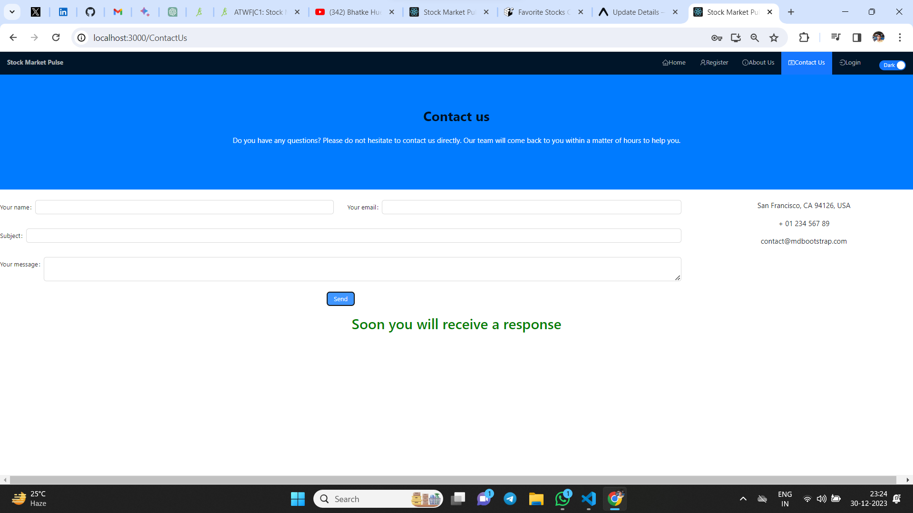

# Stock Market Dashboard

## Description

Welcome to the Stock Market Dashboard! This application provides users with real-time stock market data, analysis tools, and personalized features to track and manage stock investments. This README serves as a guide to understanding the Stock Market Dashboard app and its functionalities.

## Languge : React 

## Project Links

- GitHub: [Stock Market Dashboard -Web Version (React)](https://github.com/saurabhkumarr99/Stock-Market-Dashboard-Web)

- GitHub: [Stock Market Dashboard -App Version (React Native)](https://github.com/saurabhkumarr99/Stock-Market-Dashboard-App)

- Live: [Stock Market Dashboard -Web Version (React)](https://saurabhkumarr99.github.io/Host-Stock-Market-Web/)

- Live Expo Go Link: [Stock Market Dashboard -App Version (React Native)](exp://u.expo.dev/update/12b2b67f-f49c-4b62-bd0e-ad5407f22dd1)

- Live Expo Go QR code: Scan the following QR code with an Android device to open it in Expo Go.

<p align="center">
  
</p>

## Table of Contents

- [Features](#features)
- [Getting Started](#getting-started)
- [Usage](#usage)
- [Components Structure](#components-structure)
- [Screenshots](#screenshots)
- [Author](#author)

## Features

- **Real-time Stock Data:** Access and visualize real-time stock market data from various sources.
- **Customizable Dashboard:** Create a personalized dashboard with preferred stock categories, sectors, and performance metrics.
- **Interactive Charts:** Visualize stock data through interactive charts and graphs for in-depth analysis.
- **Favorites and Watchlists:** Manage favorite stocks and create watchlists for monitoring.
- **User Settings:** Customize settings for a tailored stock market experience.

## Getting Started

### Prerequisites

- Node.js and npm (Node Package Manager) installed on your computer.
- Node.js: [Download and Install Node.js](https://nodejs.org/)

Follow these steps to run the Blog App locally:

1. **Unzip the Stock Market Dashboard App:**

2. **Navigate to the project directory:**

   ```bash
   cd StockMarketDashboardWeb
   ``` 

2. **Install Dependencies:**

   ```bash
   npm install
   ``` 


3. **Run:**

 - `Start Project`
   ```bash
      npm start
   ``` 

 - `Test Project`
   ```bash
      npm test
   ``` 

 - `Test Coverage`
   ```bash
      npm run coverage
   ``` 

- `Selenium Testing`

   Go to SeleniumTest folder and run -
   ```bash
      node LoginTest
   ``` 


## Usage

- **Explore Stock Data**: Use the app to explore stock categories, sectors, and real-time data visualization.
- **Personalize Dashboard**:Customize your dashboard with preferred stock selections, watchlists, and charts.

## Code Structure

The project follows a structured directory layout for better organization:

- **allComponents/**
- **ScreenShots/**
- **reduxComponents/**
- **App.js**
- **README.md**

## Screenshots

<p align="center">
   
   
   
   
   
   
   
   
   
   
   
   
      
</p>


- `Unit Test`
<p align="center">
  
</p

- `Coverage Test`
<p align="center">
  
  
</p


## Author

- SAURABH KUMAR RAI

